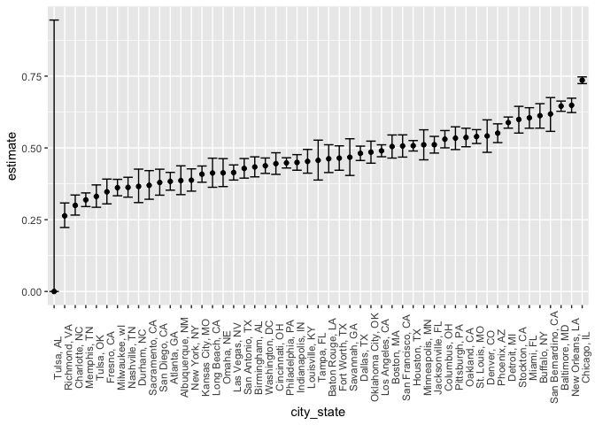

Homework 5
================
Dylan Koproski
2023-11-08

``` r
library(tidyverse)
library(rvest)
library(plotly)
```

``` r
file_name =
  list.files("data", full.names = TRUE)

df_1 =
  list.files("data", full.names = TRUE) |> 
  map_dfr(read_csv) |> 
  bind_cols(id = file_name) |>
  mutate(group = 
           case_when(
             str_detect(file_name, "con") ~ "control",
             str_detect(file_name, "exp") ~ "experimental"
             )
         ) |> 
  mutate(id_num = 
           as.integer(
             str_extract(
               id, "\\d+")
             )
         ) |> 
  relocate(id_num, group, .before = week_1) |> 
  select(!id) |> 
  pivot_longer(cols = c(week_1, week_2, week_3, week_4, week_5, week_6, week_7, week_8),
               names_to = "time",
               values_to = "value") |> 
  mutate(time = 
          as.integer(
            str_extract(
              time, "\\d+")))
```

``` r
df_1_plots =
  df_1 |> 
  mutate(subject_id = paste(group, id_num, sep = "_"))


df_1_plots |> 
  ggplot(aes(x = time, y = value, group = subject_id, color = group)) + 
  geom_line() + 
  labs(
    title = "Data Value for Participants Over Time by Group",
    x = "Time (weeks)",
    y = "Data Value"
  )
```

<!-- -->

## Problem 3

``` r
set.seed(2023)
sim_norm = function(mu, n = 30, sigma = 5) {
  
  sim_data = tibble(
    x = rnorm(mean = mu, n = n, sd = sigma),
  )
  
  sim_data |>  
    t.test(mean = 0, alternative = "two.sided", conf.level = 0.95) |> 
    broom::tidy() |> 
    select(p.value, estimate) |> 
    rename(mu_hat = estimate)
}


sim_results_df = 
  expand_grid(
    mu = c(0,1,2,3,4,5,6),
    iter = 1:5000
  ) |> 
  mutate(
    estimate_df = map(mu, sim_norm)
  ) |> 
  unnest(estimate_df)
```

``` r
sim_results_power_df =
  sim_results_df |> 
  mutate(reject = case_when(
    p.value > 0.05 ~ FALSE,
    p.value < 0.05 ~ TRUE
  )) |> 
  group_by(mu) |> 
  summarise(count = sum(reject)) |> 
  mutate(prop = count / 5000)
  

sim_results_power_df |> 
  ggplot(aes(x = mu, y = prop, fill = mu)) +
  geom_col() +
  labs(title = "Proportiobn of Rejected Hypotheses for each Mu",
       x = "True Value of Mu", y = "Proportion Rejected")
```

<!-- -->

``` r
mean_estimates_df <- sim_results_df |> 
  group_by(mu) |> 
  summarise(mean_mu_hat = mean(mu_hat)) |> 
  mutate(df = 'All Data')

rejected_estimates_df <- sim_results_df |> 
  mutate(reject = p.value < 0.05) |> 
  group_by(mu) |> 
  filter(reject == TRUE) |> 
  summarise(mean_mu_hat = mean(mu_hat)) |> 
  mutate(df = 'Rejected Null')

plot_3_df <- bind_rows(mean_estimates_df, rejected_estimates_df)

plot_3_df |> 
  ggplot(aes(x = mu, y = mean_mu_hat, color = df)) +
  geom_line() +
  geom_text(aes(label = round(mean_mu_hat, 2)), 
            vjust = -1, 
            hjust = 0.5, 
            size = 3.5) + 
  scale_color_manual(values = c('All Data' = "blue", 'Rejected Null' = "red")) +
  labs(title = "Mean Estimates and Rejections against True Value of Mu",
       x = "True Value of Mu", y = "Mean Estimate of Mu",
       color = "Data")
```

<!-- -->
